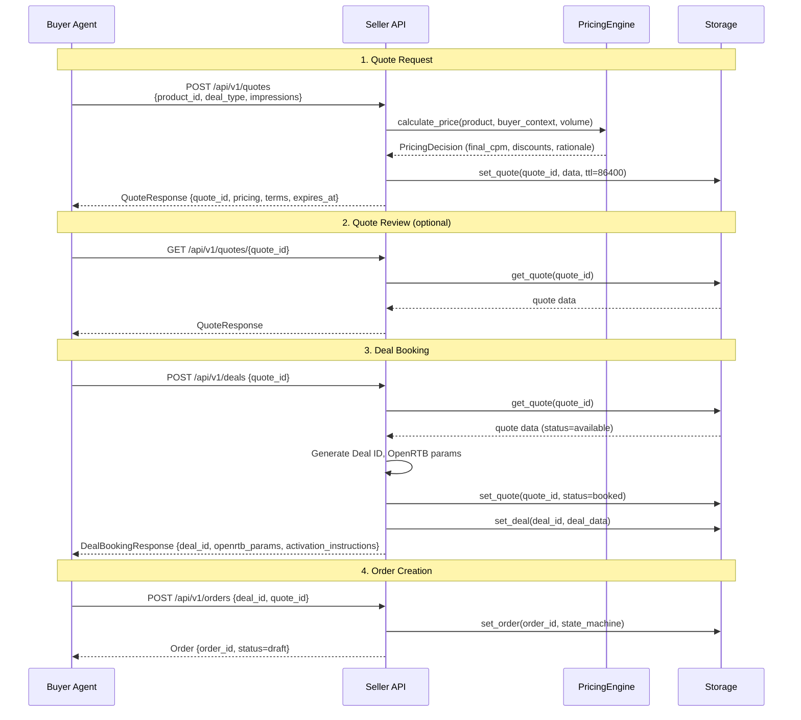
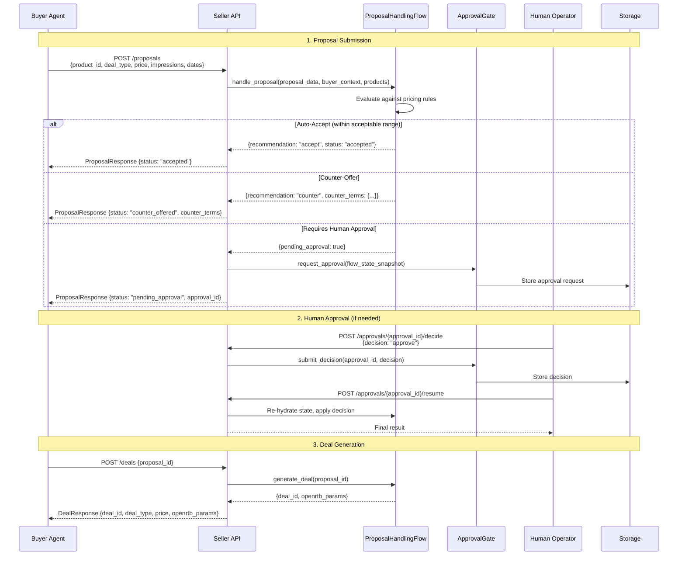
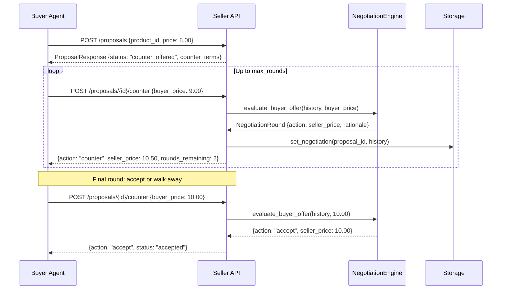

# Data Flow

This page documents the primary transaction flows between buyer and seller agents. For buyer-side implementation details, see the [Buyer Agent docs](https://iabtechlab.github.io/buyer-agent/).

## Quote-to-Deal Flow

The most common transaction pattern. The buyer requests a quote, reviews the pricing, and books a deal.

## Proposal-to-Deal Flow

For buyers who want to submit a custom proposal (different terms than a standard quote). Supports counter-offers and human approval gates.

## Negotiation Flow

When buyer and seller cannot agree on initial terms, they engage in multi-round negotiation. See [Negotiation Protocol](../integration/negotiation.md) for full details.

