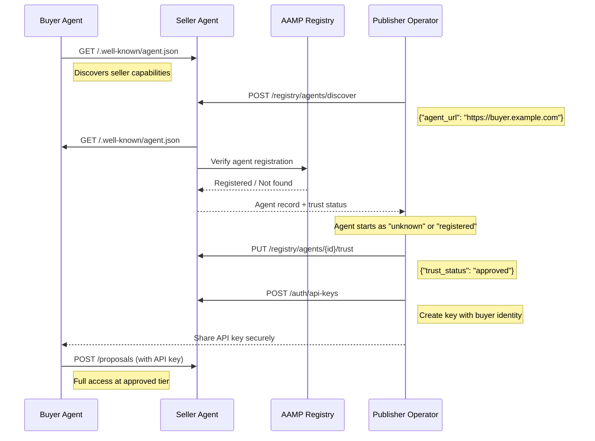

# Buyer & Agent Management

This guide covers two key operator tasks: managing **API keys** for buyer
authentication and managing **agent trust** for agent-to-agent interactions.

---

## API Key Management

API keys tie buyer identity (seat, agency, advertiser) to requests. When a buyer
presents an API key, the seller agent resolves their identity and applies the
appropriate pricing tier.

### Create an API Key

```bash
curl -X POST http://localhost:8000/auth/api-keys \
  -H "Content-Type: application/json" \
  -d '{
    "seat_id": "seat-mediamath-001",
    "seat_name": "MediaMath",
    "dsp_platform": "MediaMath",
    "agency_id": "agency-groupm-001",
    "agency_name": "GroupM",
    "agency_holding_company": "WPP",
    "advertiser_id": "adv-cocacola-001",
    "advertiser_name": "Coca-Cola",
    "label": "GroupM - Coca-Cola Q1 2026",
    "expires_in_days": 90
  }'
```

Response:

```json
{
  "key_id": "key-abc12345",
  "api_key": "sk-seller-xxxxxxxxxxxxxxxxxxxxxxxxxxxxxxxx",
  "seat_id": "seat-mediamath-001",
  "agency_id": "agency-groupm-001",
  "advertiser_id": "adv-cocacola-001",
  "label": "GroupM - Coca-Cola Q1 2026",
  "created_at": "2026-03-10T12:00:00Z",
  "expires_at": "2026-06-08T12:00:00Z"
}
```

!!! warning "Store the API Key Securely"
    The full `api_key` value is returned **only once** at creation time. It
    cannot be retrieved again. If lost, revoke the key and create a new one.

### Available Fields

| Field | Required | Description |
|-------|----------|-------------|
| `seat_id` | No | DSP seat identifier |
| `seat_name` | No | DSP seat display name |
| `dsp_platform` | No | DSP platform name |
| `agency_id` | No | Agency identifier |
| `agency_name` | No | Agency display name |
| `agency_holding_company` | No | Holding company (e.g., WPP, Omnicom) |
| `advertiser_id` | No | Advertiser identifier |
| `advertiser_name` | No | Advertiser display name |
| `label` | No | Human-readable label for this key |
| `expires_in_days` | No | Days until expiry (`null` = never expires) |

The identity fields determine the buyer's access tier:

- Only `seat_id` -> **SEAT** tier
- `seat_id` + `agency_id` -> **AGENCY** tier
- `seat_id` + `agency_id` + `advertiser_id` -> **ADVERTISER** tier
- No identity fields -> **PUBLIC** tier

### List API Keys

```bash
curl http://localhost:8000/auth/api-keys
```

Response (metadata only, no secrets):

```json
{
  "keys": [
    {
      "key_id": "key-abc12345",
      "seat_id": "seat-mediamath-001",
      "agency_id": "agency-groupm-001",
      "advertiser_id": "adv-cocacola-001",
      "label": "GroupM - Coca-Cola Q1 2026",
      "created_at": "2026-03-10T12:00:00Z",
      "expires_at": "2026-06-08T12:00:00Z",
      "is_active": true
    }
  ],
  "total": 1
}
```

### Get Key Details

```bash
curl http://localhost:8000/auth/api-keys/{key_id}
```

### Revoke an API Key

```bash
curl -X DELETE http://localhost:8000/auth/api-keys/{key_id}
```

Response:

```json
{
  "key_id": "key-abc12345",
  "status": "revoked"
}
```

Revoked keys return `401 Unauthorized` when used.

### Configuration

| Variable | Default | Description |
|----------|---------|-------------|
| `API_KEY_AUTH_ENABLED` | `true` | Enable API key authentication |
| `API_KEY_DEFAULT_EXPIRY_DAYS` | `None` | Default expiry for new keys (None = never) |

---

## Agent Trust Management

When buyer agents interact with the seller via A2A protocols, the seller agent
maintains a local registry of known agents with trust levels that control
access tiers.

### Agent Discovery

The seller agent exposes its identity at the standard A2A well-known endpoint:

```bash
curl http://localhost:8000/.well-known/agent.json
```

This returns the seller's **agent card** with capabilities, supported protocols,
and inventory types.

### Discover a Buyer Agent

To onboard a new buyer agent, discover it by URL:

```bash
curl -X POST http://localhost:8000/registry/agents/discover \
  -H "Content-Type: application/json" \
  -d '{
    "agent_url": "https://buyer-agent.example.com"
  }'
```

This performs:

1. Fetches the buyer's agent card from `https://buyer-agent.example.com/.well-known/agent.json`
2. Checks all configured registries (AAMP primary + any extras) for verification
3. Registers the agent locally with appropriate trust status
4. Returns the agent record and maximum access tier

Response:

```json
{
  "agent": {
    "agent_id": "agent-abc12345",
    "agent_card": {
      "name": "MediaBuy Agent",
      "url": "https://buyer-agent.example.com",
      "description": "Automated media buying agent",
      "version": "1.0.0"
    },
    "agent_type": "buyer",
    "trust_status": "registered",
    "registry_sources": [
      {
        "registry_id": "aamp-iab",
        "registry_name": "IAB Tech Lab AAMP",
        "verified_at": "2026-03-10T12:00:00Z"
      }
    ]
  },
  "max_access_tier": "seat",
  "is_blocked": false
}
```

### Trust Status Levels

| Trust Status | Access Tier Ceiling | Data Access | Notes |
|-------------|-------------------|-------------|-------|
| `unknown` | PUBLIC | Price ranges only | New, unverified agents |
| `registered` | SEAT | Exact prices | Verified in an external registry |
| `approved` | ADVERTISER | Full access + negotiation | Manually approved by operator |
| `preferred` | ADVERTISER | Full access + custom pricing | Strategic partners |
| `blocked` | **None** (403 rejected) | Zero data access | Explicitly blocked agents |

### List Registered Agents

```bash
# All agents
curl http://localhost:8000/registry/agents

# Filter by type
curl "http://localhost:8000/registry/agents?agent_type=buyer"

# Filter by trust status
curl "http://localhost:8000/registry/agents?trust_status=registered"
```

### Update Agent Trust

Promote an agent from `unknown` to `approved`:

```bash
curl -X PUT http://localhost:8000/registry/agents/{agent_id}/trust \
  -H "Content-Type: application/json" \
  -d '{
    "trust_status": "approved",
    "notes": "Verified identity, approved for full access"
  }'
```

Response:

```json
{
  "agent_id": "agent-abc12345",
  "trust_status": "approved",
  "max_access_tier": "advertiser",
  "notes": "Verified identity, approved for full access"
}
```

### Block an Agent

```bash
curl -X PUT http://localhost:8000/registry/agents/{agent_id}/trust \
  -H "Content-Type: application/json" \
  -d '{
    "trust_status": "blocked",
    "notes": "Suspicious behavior detected"
  }'
```

Blocked agents receive `403 Forbidden` on all requests.

### Remove an Agent

```bash
curl -X DELETE http://localhost:8000/registry/agents/{agent_id}
```

Response:

```json
{
  "agent_id": "agent-abc12345",
  "status": "removed"
}
```

---

## Onboarding Workflow

Here is the complete workflow for onboarding a new buyer agent:



### Step-by-Step

1. **Buyer discovers seller** -- The buyer agent fetches `GET /.well-known/agent.json`
   from the seller to learn about capabilities and supported protocols.

2. **Operator discovers buyer** -- The publisher operator calls
   `POST /registry/agents/discover` with the buyer agent's URL. The seller
   fetches the buyer's agent card and checks external registries.

3. **Agent is registered locally** -- The agent starts as `unknown` (PUBLIC access)
   or `registered` (SEAT access) depending on whether it was found in an
   external registry.

4. **Operator reviews and upgrades trust** -- After due diligence, the operator
   calls `PUT /registry/agents/{id}/trust` to upgrade the agent to `approved`
   or `preferred`.

5. **Operator creates API key** -- The operator creates an API key with the
   buyer's identity (seat, agency, advertiser) via `POST /auth/api-keys`.

6. **Key is shared securely** -- The operator shares the API key with the buyer
   through a secure channel.

7. **Buyer transacts** -- The buyer agent uses the API key for all subsequent
   requests, receiving pricing and access appropriate to their tier.

---

## Configuration

| Variable | Default | Description |
|----------|---------|-------------|
| `AGENT_REGISTRY_ENABLED` | `true` | Enable the agent registry |
| `AGENT_REGISTRY_URL` | `"https://tools.iabtechlab.com/agent-registry"` | Primary AAMP registry URL |
| `AGENT_REGISTRY_EXTRA_URLS` | `""` | Additional registries (comma-separated) |
| `AUTO_APPROVE_REGISTERED_AGENTS` | `true` | Auto-approve agents verified in a registry |
| `REQUIRE_APPROVAL_FOR_UNREGISTERED` | `true` | Require operator approval for unknown agents |

### Multi-Registry Support

The seller agent can check multiple registries. Each registry gets a unique
`registry_id` derived from its URL. Configure additional registries:

```bash
AGENT_REGISTRY_URL=https://tools.iabtechlab.com/agent-registry
AGENT_REGISTRY_EXTRA_URLS=https://registry.adtech-consortium.com,https://internal-registry.publisher.com
```

When an agent is discovered, all configured registries are checked. If the agent
is found in any registry, it receives `registered` trust status.

---

## Current Limitations

!!! note "AAMP Registry"
    The IAB Tech Lab AAMP (Agent-to-Agent Marketplace Protocol) registry
    integration is stubbed pending the public API specification. Currently,
    agent trust is managed locally by the operator. The `AAMPRegistryClient`
    will be updated once the AAMP spec is finalized.

!!! note "Planned Improvements"
    - Automatic trust refresh (periodic re-verification against registries)
    - Agent reputation scoring based on interaction history
    - Bulk agent import/export
    - Agent allowlists and blocklists by domain pattern
    - Webhook notifications for new agent registrations
    - API key rotation support
    - OAuth 2.0 client credentials flow (in addition to API keys)
