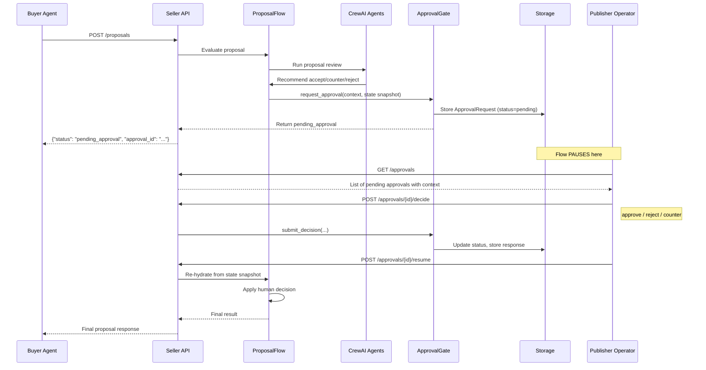

# Approval & Human-in-the-Loop

The seller agent supports human-in-the-loop approval gates that let publisher
operators review and approve (or reject) automated decisions before they are
finalized. This is critical for high-value deals or when operator oversight is
required.

---

## How Approval Works

### Enable Approval

Set these environment variables:

```bash
APPROVAL_GATE_ENABLED=true
EVENT_BUS_ENABLED=true    # Required -- approvals use the event bus
APPROVAL_TIMEOUT_HOURS=24  # Hours before a pending approval expires
APPROVAL_REQUIRED_FLOWS=proposal_decision  # Comma-separated gate names
```

### The Approval Lifecycle



### Key Design Decision

Since CrewAI flows run to completion and cannot truly pause mid-execution, the
approval pattern works by:

1. Completing the crew evaluation and capturing a **flow state snapshot**
2. Storing the snapshot alongside the approval request
3. On resume, re-hydrating the flow state from the snapshot and applying the
   human decision -- **no expensive re-computation needed**

---

## API Endpoints

### List Pending Approvals

```bash
curl http://localhost:8000/approvals
```

Response:

```json
{
  "approvals": [
    {
      "approval_id": "apr-abc12345",
      "flow_id": "flow-xyz",
      "flow_type": "proposal_handling",
      "gate_name": "proposal_decision",
      "proposal_id": "prop-123",
      "status": "pending",
      "expires_at": "2026-03-11T14:30:00Z",
      "context": {
        "recommendation": "accept",
        "buyer_name": "MediaBuy Corp",
        "product": "CTV Premium Streaming",
        "proposed_cpm": 32.50,
        "deal_value": 162500.00
      }
    }
  ]
}
```

### Get Approval Details

```bash
curl http://localhost:8000/approvals/{approval_id}
```

Response includes both the request and the response (if decided):

```json
{
  "request": {
    "approval_id": "apr-abc12345",
    "flow_id": "flow-xyz",
    "flow_type": "proposal_handling",
    "gate_name": "proposal_decision",
    "status": "pending",
    "context": { "..." : "..." }
  },
  "response": null
}
```

### Submit a Decision

```bash
curl -X POST http://localhost:8000/approvals/{approval_id}/decide \
  -H "Content-Type: application/json" \
  -d '{
    "decision": "approve",
    "decided_by": "jane@publisher.com",
    "reason": "Deal value within acceptable range"
  }'
```

Valid `decision` values:

| Decision | Effect |
|----------|--------|
| `"approve"` | Accept the crew's recommendation as-is |
| `"reject"` | Reject the proposal outright |
| `"counter"` | Modify terms before finalizing (use `modifications` field) |

Counter example with modifications:

```bash
curl -X POST http://localhost:8000/approvals/{approval_id}/decide \
  -H "Content-Type: application/json" \
  -d '{
    "decision": "counter",
    "decided_by": "jane@publisher.com",
    "reason": "Floor too low for this inventory",
    "modifications": {
      "counter_cpm": 38.00,
      "counter_terms": "Minimum 2M impressions required"
    }
  }'
```

### Resume the Flow

After submitting a decision, resume the flow to generate the final result:

```bash
curl -X POST http://localhost:8000/approvals/{approval_id}/resume
```

This re-hydrates the flow state from the snapshot, applies the human decision,
and returns the final proposal response to the caller.

!!! warning "Order of Operations"
    You must call `/decide` before `/resume`. Calling `/resume` on a still-pending
    approval returns a 400 error: `"Approval has not been decided yet. Call /decide first."`

---

## Timeout Behavior

Approvals expire after `APPROVAL_TIMEOUT_HOURS` (default: 24 hours). When an
expired approval is accessed:

- The status is automatically updated to `timed_out`
- Attempting to submit a decision on an expired approval returns a 400 error
- Expired approvals are filtered out of the `GET /approvals` pending list

---

## Configuring Which Flows Require Approval

The `APPROVAL_REQUIRED_FLOWS` setting is a comma-separated list of gate names.
Currently supported:

| Gate Name | Flow | When Triggered |
|-----------|------|---------------|
| `proposal_decision` | ProposalHandlingFlow | After crew evaluates a buyer proposal and recommends accept/counter/reject |

Example:

```bash
APPROVAL_REQUIRED_FLOWS=proposal_decision
```

When approval is not enabled (or the gate name is not in the list), the crew's
recommendation is applied automatically without operator review.

---

## Event Bus Integration

Approval events are published to the event bus when enabled:

| Event Type | When |
|-----------|------|
| `APPROVAL_REQUESTED` | A new approval request is created |
| `APPROVAL_GRANTED` | Operator approves |
| `APPROVAL_DENIED` | Operator rejects |

You can monitor these via `GET /events`.

---

## Current Limitations

!!! note "Planned Improvements"
    The approval system currently supports:

    - Proposal accept/counter/reject approval

    Planned features:

    - Approval rules engine (auto-trigger based on deal value, buyer tier, deal type)
    - Role-based routing (ops, legal, finance)
    - Deal registration approval gate
    - Order activation approval gate
    - Conditional auto-approve (e.g., auto-approve if deal value < $10K)

    See [PROGRESS.md](https://github.com/IABTechLab/seller-agent/blob/main/.beads/PROGRESS.md) for roadmap status.
    - Approval dashboard UI
    - Webhook notifications for pending approvals
    - Slack / email integration for approval alerts
    - Approval SLA tracking and escalation
