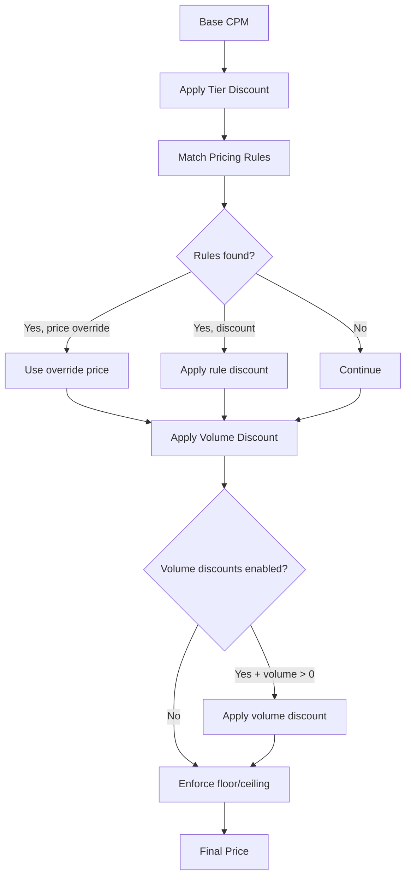

# Pricing & Access Tiers

The seller agent implements a 4-tier identity-based pricing system. Buyers who
reveal more about their identity unlock better pricing, volume discounts, and
negotiation access. This page documents how tiers, pricing rules, volume
discounts, and negotiation strategies work.

---

## The 4-Tier Pricing System

| Tier | Discount | See Exact Prices | Can Negotiate | Volume Discounts | Custom Deals |
|------|----------|------------------|---------------|------------------|--------------|
| **PUBLIC** | 0% | No (price shown as +/-20% range) | No | No | No |
| **SEAT** | 5% | Yes | No | No | Yes |
| **AGENCY** | 10% | Yes | Yes | Yes | Yes |
| **ADVERTISER** | 15% | Yes | Yes | Yes | Yes |

### Tier Details

**PUBLIC** -- General product catalog. Buyers see price *ranges* (base CPM +/-20%).
No negotiation, no volume discounts, no custom deals. Avails granularity: `high_level`.

**SEAT** -- Authenticated DSP seat. Buyers see exact prices with a 5% discount
from base. Custom deals are enabled but negotiation and volume discounts are not.
Avails granularity: `moderate`.

**AGENCY** -- Agency-level pricing. 10% discount, full negotiation access,
volume discounts, premium inventory access. Avails granularity: `detailed`.

**ADVERTISER** -- Best available rates. 15% discount, full negotiation, volume
discounts, premium inventory, and custom deals. Avails granularity: `detailed`.

---

## How Tier Is Determined

A buyer's effective tier is determined by the combination of their **claimed
identity** and their **agent trust status**.

### Step 1: Claimed Tier

The buyer provides identity fields via API key or request body:

- `seat_id` alone -> SEAT tier
- `seat_id` + `agency_id` -> AGENCY tier
- `seat_id` + `agency_id` + `advertiser_id` -> ADVERTISER tier
- No identity -> PUBLIC tier

### Step 2: Trust Cap (for Agent-to-Agent)

When the buyer is an agent, the agent registry trust status sets a ceiling:

| Trust Status | Maximum Access Tier |
|-------------|-------------------|
| `unknown` | PUBLIC |
| `registered` | SEAT |
| `approved` | ADVERTISER |
| `preferred` | ADVERTISER |
| `blocked` | **Denied** (403) |

### Step 3: Effective Tier

The effective tier is the **minimum** of the claimed tier and the trust cap:

```
effective_tier = min(claimed_tier, trust_ceiling)
```

For example, if an agent claims ADVERTISER tier but its trust status is
`registered` (ceiling: SEAT), the effective tier is SEAT.

---

## Pricing Calculation Flow

The `PricingRulesEngine` calculates final prices through these steps:



### Step-by-step:

1. **Start with product `base_cpm`**
2. **Apply tier discount** (0%, 5%, 10%, or 15%)
3. **Match pricing rules** -- Rules can match by tier, agency ID, advertiser ID,
   holding company, product ID, or inventory type. Rules are sorted by priority
   (highest first). A `base_price_override` on a rule takes precedence and stops
   further rule evaluation.
4. **Apply volume discounts** (if tier allows and volume > 0)
5. **Enforce floor/ceiling** -- Global floor CPM (default: $1.00), global ceiling
   (if set)

### Pricing Rules

Rules are matched against the buyer context and can specify:

| Field | Description |
|-------|-------------|
| `access_tier` | Match specific tier only |
| `agency_ids` | Match specific agencies |
| `advertiser_ids` | Match specific advertisers |
| `holding_company_ids` | Match specific holding companies |
| `product_ids` | Match specific products |
| `inventory_types` | Match specific inventory types |
| `base_price_override` | Override the base price entirely |
| `discount_percentage` | Additional discount (0-1) |
| `price_floor` | Rule-specific floor |
| `price_ceiling` | Rule-specific ceiling |
| `volume_discounts` | Rule-specific volume discount brackets |
| `negotiation_enabled` | Whether negotiation is allowed under this rule |
| `max_negotiation_discount` | Maximum additional discount from negotiation |

When multiple rules match, their discounts are evaluated and the **highest**
discount percentage is applied (not stacked).

---

## Default Volume Discounts

Volume discounts apply when the buyer's tier has `volume_discounts_enabled=True`
(AGENCY and ADVERTISER tiers) and the buyer specifies an impression volume.

If no custom volume discount rules are configured, these defaults apply:

| Minimum Impressions | Discount |
|--------------------|----------|
| 50,000,000+ | 20% |
| 20,000,000+ | 15% |
| 10,000,000+ | 10% |
| 5,000,000+ | 5% |

Volume discounts are applied **after** tier and rule discounts.

---

## Negotiation Strategy Per Tier

Each tier maps to a negotiation strategy with specific concession limits:

| Tier | Strategy | Max Rounds | Per-Round Concession Cap | Total Concession Cap | Buyer Gap Share |
|------|----------|------------|-------------------------|---------------------|-----------------|
| **PUBLIC** | AGGRESSIVE | 3 | 3% | 8% | 30% |
| **SEAT** | STANDARD | 4 | 4% | 12% | 40% |
| **AGENCY** | COLLABORATIVE | 5 | 5% | 15% | 50% |
| **ADVERTISER** | PREMIUM | 6 | 6% | 20% | 65% |

### How Negotiation Works

1. **Negotiation starts** from the tier-adjusted base price (base CPM minus tier discount)
2. Each round, the buyer submits an offer
3. The engine evaluates:
    - **Accept** if the buyer's offer meets or exceeds the seller's last price
    - **Reject** if the buyer's offer is below the absolute floor price
    - **Reject** if the maximum number of rounds is exceeded
    - **Final offer** if approaching the total concession cap (within 80%) or on the last round
    - **Counter** otherwise, using gap-split: `counter = buyer_price + gap * (1 - buyer_gap_share)`
4. Each counter is clamped by the per-round concession cap and the total concession cap
5. The counter never goes below the product floor price

### Gap-Split Example (AGENCY Tier)

- Base price (after 10% tier discount): $31.50
- Buyer offers: $25.00
- Gap: $31.50 - $25.00 = $6.50
- Buyer share: 50%
- Seller concedes: $6.50 * 0.50 = $3.25
- Counter: $31.50 - $3.25 = $28.25
- Per-round cap check: 5% of $31.50 = $1.575 max drop... $3.25 exceeds cap
- Clamped counter: $31.50 - $1.575 = $29.93

---

## Cross-Advertiser Pricing Consistency

The seller agent enforces consistent pricing for the same advertiser regardless
of which agency submits the request. This is controlled by the
`advertiser_pricing_consistent` flag (default: `True`).

When enabled:

- If Advertiser X gets a $28 CPM through Agency A, Agency B submitting for
  Advertiser X will see the same $28 CPM
- This prevents arbitrage and ensures advertiser-level pricing integrity
- The agency's own tier discount still applies to the base calculation

---

## Price Display by Tier

| Tier | Display Format | Example (base $35 CPM) |
|------|---------------|----------------------|
| PUBLIC | Range (+/-20%) | "$28 - $42 CPM" |
| SEAT | Exact (5% off) | "$33.25 CPM" |
| AGENCY | Exact (10% off) | "$31.50 CPM" |
| ADVERTISER | Exact (15% off) | "$29.75 CPM" |

---

## Pricing Configuration Defaults

| Parameter | Default | Description |
|-----------|---------|-------------|
| `global_floor_cpm` | $1.00 | Absolute minimum CPM |
| `global_ceiling_cpm` | None | No ceiling by default |
| `default_currency` | `"USD"` | Currency for all pricing |
| `advertiser_pricing_consistent` | `True` | Same advertiser = same price across agencies |
| `price_range_variance` | 0.2 | +/-20% for PUBLIC tier ranges |

---

## Current Limitations

!!! note "Customization Roadmap"
    Currently, tier discounts, volume brackets, and negotiation limits are
    code-level defaults in `pricing_tiers.py` and `negotiation.py`. A runtime
    Pricing Rules API is planned to allow:

    - Custom discount percentages per tier
    - Per-agency or per-advertiser pricing overrides
    - Custom volume discount brackets
    - Adjustable negotiation concession limits
    - Per-product floor/ceiling overrides
    - Rule CRUD via REST API
    - Time-bound rules (valid_from / valid_to)
    - Rule priority management

    See [PROGRESS.md](https://github.com/IABTechLab/seller-agent/blob/main/.beads/PROGRESS.md) for roadmap status.
