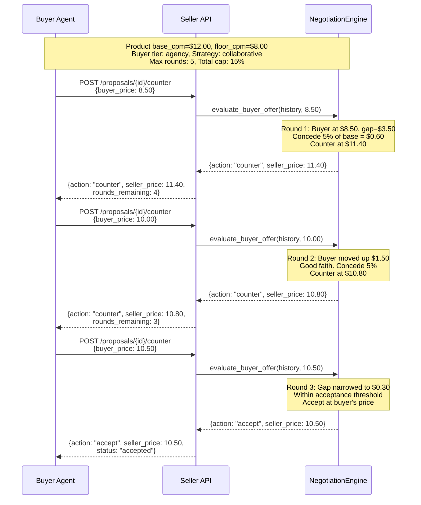

# Negotiation Protocol

The seller agent supports multi-round automated price negotiation. The negotiation engine uses buyer-tier-based strategies with configurable concession limits to reach agreement or walk away.

## Overview

Negotiation is initiated when a buyer submits a counter-offer on a proposal. The seller evaluates each offer against its strategy, makes a concession (or not), and responds with one of four actions: `accept`, `counter`, `final_offer`, or `reject`.

## Endpoints

| Method | Path | Description |
|--------|------|-------------|
| POST | `/proposals/{proposal_id}/counter` | Submit a counter-offer |
| GET | `/proposals/{proposal_id}/negotiation` | Get full negotiation history |

## Negotiation Strategies

Strategies are mapped from the buyer's access tier:

| Access Tier | Strategy | Max Rounds | Per-Round Cap | Total Cap | Buyer Gap Share |
|-------------|----------|------------|---------------|-----------|-----------------|
| `public` | `aggressive` | 3 | 3% | 8% | 30% |
| `seat` | `standard` | 4 | 4% | 12% | 40% |
| `agency` | `collaborative` | 5 | 5% | 15% | 50% |
| `advertiser` | `premium` | 6 | 6% | 20% | 65% |

- **Max Rounds** --- Maximum number of negotiation rounds before walk-away
- **Per-Round Cap** --- Maximum percentage concession the seller makes in a single round
- **Total Cap** --- Maximum cumulative concession across all rounds
- **Buyer Gap Share** --- How much of the price gap the seller expects the buyer to close (higher = more favorable to seller)

## NegotiationLimits Model

```
max_rounds: int               # Maximum rounds before walk-away
per_round_concession_cap: float  # Max % concession per round (0-1)
total_concession_cap: float      # Max cumulative % concession (0-1)
gap_split_buyer_share: float     # Buyer's share of gap (0-1)
```

## NegotiationRound Model

Each round records:

| Field | Type | Description |
|-------|------|-------------|
| `round_number` | int | Sequential round number |
| `buyer_price` | float | What the buyer offered |
| `seller_price` | float | What the seller countered (or accepted at) |
| `action` | NegotiationAction | `accept`, `counter`, `reject`, or `final_offer` |
| `concession_pct` | float | How much the seller conceded this round (0-1) |
| `cumulative_concession_pct` | float | Total concession so far (0-1) |
| `rationale` | string | Explanation of the seller's decision |
| `timestamp` | datetime | When the round occurred |

## NegotiationHistory Model

| Field | Type | Description |
|-------|------|-------------|
| `negotiation_id` | string | `neg-{hex}` identifier |
| `proposal_id` | string | Associated proposal |
| `product_id` | string | Product being negotiated |
| `buyer_tier` | AccessTier | Buyer's access tier |
| `strategy` | NegotiationStrategy | Selected strategy |
| `limits` | NegotiationLimits | Concession limits for this strategy |
| `base_price` | float | Seller's starting price (tier-adjusted) |
| `floor_price` | float | Absolute floor (product floor, cannot go below) |
| `rounds` | list[NegotiationRound] | All rounds so far |
| `status` | string | `active`, `accepted`, `rejected`, `expired` |
| `started_at` | datetime | When negotiation began |
| `completed_at` | datetime | When negotiation ended (if terminal) |
| `package_id` | string | Package ID if negotiating on a package |

## Example: 3-Round Negotiation



### Counter-Offer Request

```bash
curl -X POST http://localhost:8000/proposals/prop-a1b2c3d4/counter \
  -H "Content-Type: application/json" \
  -H "Authorization: Bearer <api_key>" \
  -d '{
    "buyer_price": 10.00,
    "buyer_tier": "agency",
    "agency_id": "agency-mega"
  }'
```

### Counter-Offer Response

```json
{
  "negotiation_id": "neg-f1e2d3c4",
  "round_number": 2,
  "action": "counter",
  "buyer_price": 10.00,
  "seller_price": 10.80,
  "concession_pct": 0.05,
  "cumulative_concession_pct": 0.10,
  "rationale": "Collaborative strategy: 5% concession, buyer showing good faith movement",
  "status": "active",
  "rounds_remaining": 3
}
```

### Get Negotiation History

```bash
curl http://localhost:8000/proposals/prop-a1b2c3d4/negotiation
```

Returns the full `NegotiationHistory` including all rounds, strategy, limits, and current status.

## Negotiation Actions

| Action | Description |
|--------|-------------|
| `accept` | Seller accepts the buyer's price. Negotiation concludes successfully. |
| `counter` | Seller makes a concession and proposes a new price. |
| `final_offer` | Seller's last offer before walking away. Buyer must accept or the negotiation ends. |
| `reject` | Seller walks away. Negotiation concludes without agreement. |

## Events Emitted

The negotiation engine emits three event types:

- `negotiation.started` --- When the first counter-offer creates a new negotiation
- `negotiation.round` --- After each round, with round number, action, and prices
- `negotiation.concluded` --- When the negotiation reaches `accepted` or `rejected` status
