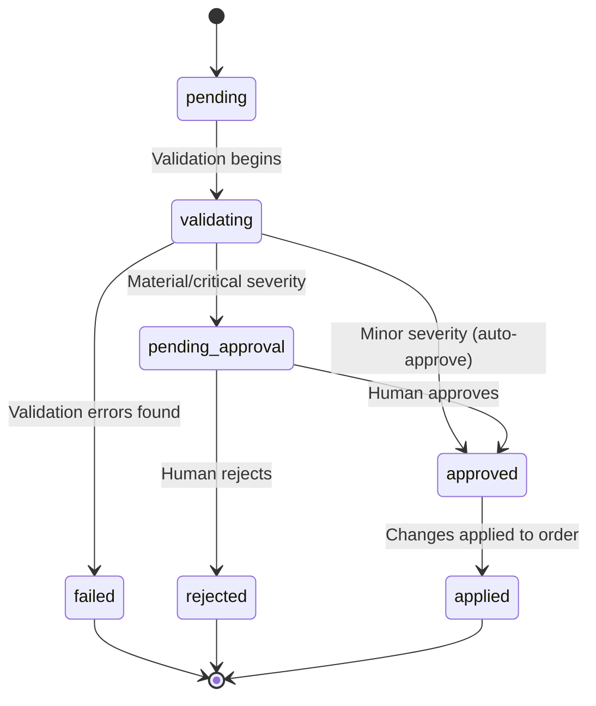
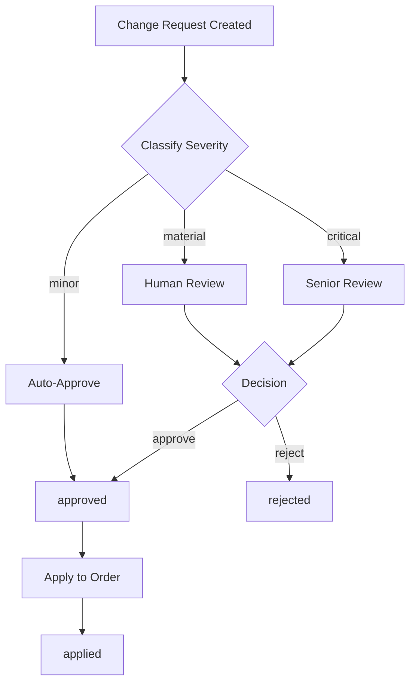

# Change Request Flow

Change requests follow a validation-and-approval pipeline with 7 statuses. Severity determines the approval path.

Defined in `src/ad_seller/models/change_request.py`.

## State Diagram

## Statuses

| Status | Description |
|--------|-------------|
| `pending` | Change request created, not yet validated |
| `validating` | Being validated against the current order state |
| `pending_approval` | Passed validation, awaiting human review (material or critical severity) |
| `approved` | Approved for application (auto-approved for minor, human-approved for material/critical) |
| `rejected` | Rejected by human reviewer |
| `applied` | Changes successfully applied to the order |
| `failed` | Validation failed (e.g., order in terminal state, invalid values) |

## Approval Routing by Severity

### Severity Classification Rules

| Change Type | Default Severity | Special Rules |
|-------------|-----------------|---------------|
| `creative` | `minor` | Always auto-approved |
| `flight_dates` | `material` | Downgraded to `minor` if date shift is 3 days or less |
| `impressions` | `material` | |
| `targeting` | `material` | |
| `other` | `material` | |
| `pricing` | `critical` | Always critical; upgraded further consideration if price change >20% |
| `cancellation` | `critical` | |

## Validation Rules

Before entering the approval pipeline, each change request is validated:

1. **Terminal state check** --- Cannot modify orders in `completed`, `cancelled`, or `failed` status.
2. **Cancellation eligibility** --- Cancellation only from active states: `draft`, `submitted`, `pending_approval`, `approved`, `in_progress`, `booked`.
3. **Impression positivity** --- Impression changes must result in a positive integer.

Validation failures set the status to `failed` and return HTTP 422 with the error list.

## Data Model

The `ChangeRequest` model tracks the full lifecycle:

| Field | Type | Description |
|-------|------|-------------|
| `change_request_id` | string | Auto-generated `CR-{hex}` |
| `order_id` | string | The order being modified |
| `deal_id` | string | Associated deal ID |
| `status` | ChangeRequestStatus | Current lifecycle status |
| `change_type` | ChangeType | Category of change |
| `severity` | ChangeSeverity | `minor`, `material`, or `critical` |
| `requested_by` | string | Who requested the change |
| `requested_at` | datetime | When the request was created |
| `reason` | string | Explanation for the change |
| `diffs` | list[FieldDiff] | Field-level changes: `{field, old_value, new_value}` |
| `proposed_values` | dict | Key-value pairs of new values |
| `validation_errors` | list[str] | Errors from validation (if failed) |
| `pricing_impact` | dict | Impact on pricing (if applicable) |
| `availability_check` | dict | Inventory availability result |
| `approved_by` | string | Who approved/rejected |
| `approved_at` | datetime | When the decision was made |
| `rejection_reason` | string | Reason for rejection |
| `applied_at` | datetime | When changes were applied |
| `applied_by` | string | Who applied the changes |
| `rollback_snapshot` | dict | Snapshot of order state before changes (for rollback) |
