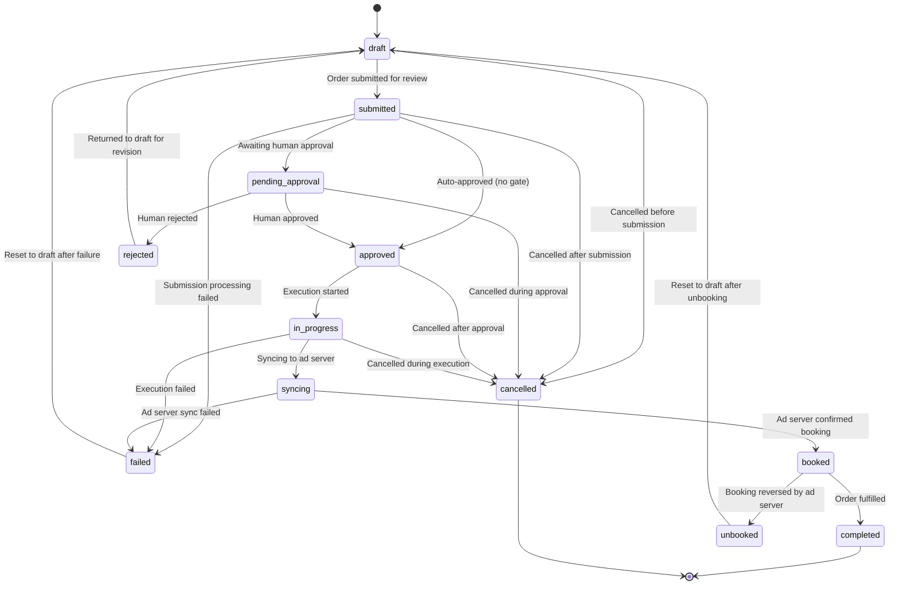

# Order Lifecycle State Machine

Orders use a formal state machine with **12 states** and **20 transitions**. Every state change is recorded in an immutable audit log.

Defined in `src/ad_seller/models/order_state_machine.py`.

## State Diagram



## States

### Entry States

| Status | Description |
|--------|-------------|
| `draft` | Initial state. Order created but not yet submitted. |
| `submitted` | Order submitted for review or processing. |

### Approval Gate

| Status | Description |
|--------|-------------|
| `pending_approval` | Awaiting human approval decision. |
| `approved` | Approved (auto or human). Ready for execution. |
| `rejected` | Rejected by human reviewer. Can return to draft. |

### Execution

| Status | Description |
|--------|-------------|
| `in_progress` | Execution has started. |
| `syncing` | Syncing order to the ad server. |

### Terminal States

| Status | Description |
|--------|-------------|
| `completed` | Order successfully fulfilled. |
| `failed` | Processing or execution failed. Can return to draft. |
| `cancelled` | Cancelled at any active stage. |

### Ad-Server Specific

| Status | Description |
|--------|-------------|
| `booked` | Ad server has confirmed the booking. |
| `unbooked` | Booking was reversed by the ad server. Can return to draft. |

## Transition Table

All 20 allowed transitions:

| # | From | To | Description |
|---|------|-----|-------------|
| 1 | `draft` | `submitted` | Order submitted for review |
| 2 | `submitted` | `pending_approval` | Awaiting human approval |
| 3 | `submitted` | `approved` | Auto-approved (no gate) |
| 4 | `pending_approval` | `approved` | Human approved |
| 5 | `pending_approval` | `rejected` | Human rejected |
| 6 | `approved` | `in_progress` | Execution started |
| 7 | `in_progress` | `syncing` | Syncing to ad server |
| 8 | `syncing` | `booked` | Ad server confirmed booking |
| 9 | `booked` | `completed` | Order fulfilled |
| 10 | `booked` | `unbooked` | Booking reversed by ad server |
| 11 | `draft` | `cancelled` | Cancelled before submission |
| 12 | `submitted` | `cancelled` | Cancelled after submission |
| 13 | `submitted` | `failed` | Submission processing failed |
| 14 | `pending_approval` | `cancelled` | Cancelled during approval |
| 15 | `approved` | `cancelled` | Cancelled after approval |
| 16 | `in_progress` | `failed` | Execution failed |
| 17 | `in_progress` | `cancelled` | Cancelled during execution |
| 18 | `syncing` | `failed` | Ad server sync failed |
| 19 | `rejected` | `draft` | Returned to draft for revision |
| 20 | `failed` | `draft` | Reset to draft after failure |

Note: Transition 21 (`unbooked` -> `draft`, "Reset to draft after unbooking") brings the total to 21 transitions from the `_DEFAULT_TRANSITIONS` list. The state diagram above reflects all of them.

## Audit Trail

Every transition creates an immutable `StateTransition` record:

| Field | Type | Description |
|-------|------|-------------|
| `transition_id` | string | UUID |
| `from_status` | OrderStatus | Previous state |
| `to_status` | OrderStatus | New state |
| `timestamp` | datetime | When the transition occurred |
| `actor` | string | Who initiated: `system`, `human:<user_id>`, `agent:<agent_id>` |
| `reason` | string | Why the transition happened |
| `metadata` | dict | Additional context |

## Guard Conditions

Transitions can have optional guard functions. A guard is a callable with signature:

```python
(order_id: str, from_status: OrderStatus, to_status: OrderStatus, context: dict) -> bool
```

If the guard returns `False`, the transition raises `InvalidTransitionError`. Default transitions have no guards.

## Extending the State Machine

Add custom transitions for vertical-specific workflows:

```python
from ad_seller.models.order_state_machine import OrderStateMachine, TransitionRule, OrderStatus

machine = OrderStateMachine(order_id="ORD-001")
machine.add_rule(TransitionRule(
    from_status=OrderStatus.APPROVED,
    to_status=OrderStatus.BOOKED,
    description="Direct booking (skip syncing)",
))
```
